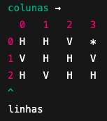

# Estrutura geral do programa

O programa precisa:

1. **Ler os dados de entrada** (n, matriz, posição inicial).
2. **Implementar uma função recursiva com backtracking** que percorre o prédio.
3. **Verificar se a chave pode ser encontrada**.
4. **Imprimir a mensagem final** correta.

---

# Estrutura de dados

* Uma matriz `char edificio[MAX][MAX]` para armazenar `H`, `V` ou `*`.
* Uma matriz `int visitado[MAX][MAX]` para marcar posições já exploradas.
* Variáveis locais no `main` para dimensões (`n`, `m`) e posição inicial.
* A função `busca` recebe todos esses dados como parâmetros, evitando o uso de variáveis globais.

---

# Como a matriz funciona

---

# Funções principais

* `int busca(char edificio[][MAX], int visitado[][MAX], int n, int m, int linha, int coluna)` → função recursiva que:

  1. Verifica limites.
  2. Checa se já visitou.
  3. Se encontrar `*`, retorna sucesso (1).
  4. Se for `H`, tenta esquerda/direita.
  5. Se for `V`, tenta cima/baixo.
  6. Usa **backtracking** (marca e desmarca posições).

* `int main()` → responsável por:

  1. Ler a entrada.
  2. Calcular o número de colunas (`m`) a partir da primeira linha.
  3. Inicializar a matriz de visitados.
  4. Chamar `busca`.
  5. Imprimir o resultado final.

---
